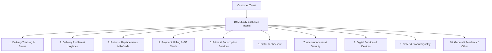

# AmazonHelp Final Intent Taxonomy Specification (Step 1.7)

**Document Purpose:** Definitive, mutually exclusive intent taxonomy for classifying customer inquiries directed to `@AmazonHelp`.  
**Dataset Grounding:** Verified TWCS dataset (`data/processed/AmazonHelp_tweets.csv`, N=203,598 customer turns).  
**Sampling Baseline:** Empirical audit of 500 randomly sampled messages (Seed `42`).

---

## Architectural Principles & Separation of Concerns

1. **Language is Not an Intent:**  
   Customer language is captured as an orthogonal metadata field (e.g. `language: "es"`, `language: "ja"`, `language: "en"`). Multilingual queries are classified into their underlying business intent.
2. **Conversation State is Not an Intent:**  
   Operational dialogue state is captured in a dedicated field (`conversation_state`):
   - `new_issue`: Initial inquiry starting a conversation thread.
   - `active_troubleshooting`: Mid-thread exchange diagnosing technical or order details.
   - `dm_handoff`: Customer stating they sent or are sending a direct message (*"Sent DM"*, *"Check inbox"*, *"Lo paso por DM"*).
   - `follow_up`: Providing requested details (order number, tracking ID, screenshot) in response to support.
   - `resolved_or_acknowledgment`: Expressing thanks or closing out a thread (*"Thanks, all good now"*).
   - `unclear`: Fragmentary or ambiguous statements lacking operational context.
3. **Escalation & Security are Not Separate Routing Intents:**  
   Security, fraud, and phishing alerts belong to `Account Access & Security` with an orthogonal priority attribute (`is_security_fraud_alert: true`, `priority: "P0_CRITICAL"`).

---

## The 10 Final Intent Classes

---

### 1. Delivery Tracking & Status

- **Definition:** Inquiries regarding the current whereabouts, transit status, carrier information, or estimated arrival time (ETA) of a package that is **currently in transit within its expected delivery SLA window**.
- **Inclusion Criteria:**
  - Asking for a tracking number, carrier name, or status update while the order is still within the promised delivery window.
  - Inquiring when an order will be dispatched, shipped, or delivered before an SLA breach has occurred.
  - Clarifying tracking information discrepancies that do not allege a failure to deliver.
- **Exclusion Criteria:**
  - Package is overdue, delayed past promised date/time, or delivery SLA has been breached $\rightarrow$ `Delivery Problem & Logistics`.
  - Package is marked delivered by the courier but is missing/stolen $\rightarrow$ `Delivery Problem & Logistics`.
  - Complaints regarding courier conduct, fake delivery attempts, or damaged shipping boxes $\rightarrow$ `Delivery Problem & Logistics`.
- **Real Dataset Examples:**
  1. **[Tweet 751683 | User 137851]**: `@AmazonHelp Uno de los productos sí, el otro aparece como pendiente. Iban en la misma caja supongo, porque tenia un sólo número de seguimiento.`
  2. **[Tweet 865619 | User 193718]**: `@AmazonHelp the second item I to be delivered today, maybe. Not updated tracking since Tuesday. Tracking useless`
  3. **[Tweet 313487 | User 190857]**: `@AmazonHelp Sorry about that... thought it will help track... Reached out our contact person in chat and have raised a concern hope to get resolved soon`
  4. **[Tweet 2795411 | User 779220]**: `@AmazonHelp Nee aber hab es gerade selber gelöst... bei Gutschein ist der Versand ja kostenlos und automatisch auf Premium... hab das jetzt auf Standard gestellt jetzt bezahl ich kein Versand 👍🏽`
- **Closest Competing Intent:** `Delivery Problem & Logistics`
- **Exact Boundary Rule:** If the customer explicitly states or implies that the delivery is **late, overdue, missed the SLA window, marked delivered but missing, or complains about courier misconduct**, it MUST be classified as **`Delivery Problem & Logistics`**. It is only `Delivery Tracking & Status` when the package is still progressing within its normal delivery window without an established failure.

---

### 2. Delivery Problem & Logistics

- **Definition:** Escalations concerning a failure in the physical delivery, fulfillment, or doorstep handover of an order. Includes missed delivery dates/times, false delivery scans, packages left in inappropriate locations, courier misconduct, stolen parcels, and transit damage.
- **Inclusion Criteria:**
  - Orders that have passed their guaranteed or estimated delivery date/time.
  - False delivery claims: carrier claims "delivery attempted / customer not home", but customer was present.
  - Tracking displays "Delivered", but the parcel was not received (lost, stolen, misdelivered to wrong address).
  - Parcels left in unsafe places (e.g. in the rain, public hallways, trash bins, thrown over fences).
  - Shipping box or physical packaging arrived crushed, torn, wet, or opened in transit.
- **Exclusion Criteria:**
  - In-transit inquiries where the package is still within the promised window $\rightarrow$ `Delivery Tracking & Status`.
  - Inquiries asking *how to return* a damaged product or requesting a refund for a missing item $\rightarrow$ `Returns, Replacements & Refunds`.
  - Complaints about item manufacturing defects rather than courier shipping damage $\rightarrow$ `Seller & Product Quality`.
- **Real Dataset Examples:**
  1. **[Tweet 851597 | User 322297]**: `Why is it @115830 that you guys said I wasn't in to take my delivery when i was, not even a knock at the door`
  2. **[Tweet 401586 | User 210965]**: `@AmazonHelp Thanks. Expected 8 October. 9 October almost done and still not delivered. Contacting you ‘for assistance’ not easy. https://t.co/p35ECOI8o7`
  3. **[Tweet 1392412 | User 443851]**: `@AmazonHelp just found my parcel left right by notice saying not to leave parcels. I was home too &amp; courier didn’t attempt contact #fail https://t.co/a2BtiOMlrZ`
  4. **[Tweet 449950 | User 221644]**: `@115821 your delivery driver is a liar. Sitting next to the door when I recieved failed delivery email - driver never even rang the bell. Been on hold to customer services for 30mins now &amp; you've still not answered my call. What am I paying prime membership for? Shocking service.`
  5. **[Tweet 666973 | User 278937]**: `Great! Order reached in city yet delayed. Pay &amp; wait for months with @115821 The worst service always. No consumer consideration. Go to hell @115850 Tired of this. https://t.co/YJc4meO7PU`
- **Closest Competing Intent:** `Delivery Tracking & Status` and `Prime & Subscription Services`
- **Exact Boundary Rule:** If a customer mentions "Prime" only to emphasize that their guaranteed fast shipping was breached (*"I pay for Prime, why is it 2 days late?"*), classify as **`Delivery Problem & Logistics`**, NOT Prime. If the parcel failed to arrive or arrived damaged by shipping, it is always `Delivery Problem & Logistics`.

---

### 3. Returns, Replacements & Refunds

- **Definition:** Requests or inquiries concerning returning an item, exchanging/replacing an item, obtaining return mailing labels/drop-off instructions, or tracking the financial refund resulting from a returned or cancelled item.
- **Inclusion Criteria:**
  - Questions regarding how to initiate a return, return policies, or return window deadlines.
  - Requesting a replacement or exchange for an incorrect or damaged shipment.
  - Return drop-off logistics (e.g. UPS drop-off points, pickup scheduling, QR code labels).
  - Status of a pending refund following a return, cancelled order, or return pickup.
- **Exclusion Criteria:**
  - Unrecognized card charges or billing discrepancies unrelated to a return/cancellation $\rightarrow$ `Payment, Billing & Gift Cards`.
  - General product defects without an explicit return/refund request $\rightarrow$ `Seller & Product Quality`.
  - Asking to cancel an order before it has dispatched $\rightarrow$ `Order & Checkout`.
- **Real Dataset Examples:**
  1. **[Tweet 2739360 | User 767510]**: `@115830 my delivery was left outside in the pouring rain today. The box is saturated and one of the books wet. How do I get a replacement? https://t.co/0X7QS2dZuP`
  2. **[Tweet 1116171 | User 383383]**: `@115850 I press the button to return the bad product and ur cs says will replace the same bad product. Why did you make return button?`
  3. **[Tweet 155240 | User 151603]**: `@AmazonHelp very very bad customer support provided by you i order a product and receive defective product and apply i again apply for order refund 15.11.17  but not response.i also talk with agents but they not give right suggestion.@118702 is better for purchase.`
  4. **[Tweet 2265427 | User 659443]**: `@AmazonHelp I haven't placed any order. I just wanted to know about your tnc for exchange?`
  5. **[Tweet 1315532 | User 427121]**: `@115850 I HV ordred a prodct, waitin fo return pickup sinc last 9-10 dez &amp; not refunding coz de r unable to pickup on the scheduled time.`
- **Closest Competing Intent:** `Payment, Billing & Gift Cards` and `Seller & Product Quality`
- **Exact Boundary Rule:** If money is owed to the customer **as a result of a return, exchange, cancellation, or returned package**, classify under **`Returns, Replacements & Refunds`**. If the customer is inquiring about an unexpected debit, credit card charge, or invoice, classify under `Payment, Billing & Gift Cards`.

---

### 4. Payment, Billing & Gift Cards

- **Definition:** Inquiries and disputes regarding payment processing, unauthorized charges, double debits, gift card redemption, Amazon Pay wallet balances, Cash on Delivery (COD) rules, and official tax invoices.
- **Inclusion Criteria:**
  - Customer being charged twice for a single order or seeing an unrecognized debit on their bank statement.
  - Payment method declined, expired card updates, or checkout payment processing errors.
  - Gift card balance inquiries, failed gift card claims, or promotional credit balance redemption.
  - Invoice generation, VAT/tax breakdown, or business GST invoicing.
  - Cash on Delivery (COD) disputes or delivery agent payment demands.
- **Exclusion Criteria:**
  - A refund owed because the customer returned an item $\rightarrow$ `Returns, Replacements & Refunds`.
  - Prime subscription fee disputes (e.g. annual Prime auto-renew fee) $\rightarrow$ `Prime & Subscription Services`.
  - Fraudulent account takeover where unauthorized orders were placed $\rightarrow$ `Account Access & Security`.
- **Real Dataset Examples:**
  1. **[Tweet 2320709 | User 672569]**: `@AmazonHelp such serious issue and amazon india CEO should be made aware and examine it. COD is harassing customers`
  2. **[Tweet 2292114 | User 663171]**: `@AmazonHelp I don't want to extend the credit limit, I want to pay the extra amount by advance. Any ideas ?`
  3. **[Tweet 1905644 | User 567849]**: `@115850 Bt d customer hasn't mentioned my GST no..he needs to update his invoice..tried 4 times 2 do dat wid customer care dey rnt helping. PL help`
  4. **[Tweet 1730156 | User 217963]**: `@AmazonHelp Something about EU-UK and Luxembourg. I think I’ve been charged for my items individually rather than in one go🙄😂`
  5. **[Tweet 987197 | User 190855]**: `@115850 How do i add more than 20,000 in amazon pay wallet to purchase an iphone and avail the cashback of Rs.500 ??`
- **Closest Competing Intent:** `Returns, Replacements & Refunds` and `Prime & Subscription Services`
- **Exact Boundary Rule:** If the dispute is about a charge originating from Amazon without a return (e.g., checkout charge, gift card balance, invoice, COD), classify as **`Payment, Billing & Gift Cards`**. If the customer is asking for money back after returning a physical item, it is `Returns, Replacements & Refunds`.

---

### 5. Prime & Subscription Services

- **Definition:** Inquiries strictly concerning Amazon Prime membership, subscription renewal, fee changes, subscription cancellations, student Prime benefits, or subscription-tier benefits (Prime Music, Kindle Unlimited, Audible).
- **Inclusion Criteria:**
  - Prime membership sign-up, free trial terms, auto-renewal settings, or cancellation requests.
  - Inquiries regarding subscription fee amounts, billing dates, or student discount validation.
  - Clarification of Prime benefits (e.g. Prime Video access, Prime early access deals) unrelated to a specific late package delivery.
  - Non-Prime digital subscriptions (Kindle Unlimited, Audible, Amazon Music Unlimited).
- **Exclusion Criteria:**
  - Complaining that a Prime order was delivered late $\rightarrow$ `Delivery Problem & Logistics`.
  - Prime Video streaming playback failure, buffering, or app crash $\rightarrow$ `Digital Services & Devices`.
  - Returning a physical item purchased with Prime $\rightarrow$ `Returns, Replacements & Refunds`.
- **Real Dataset Examples:**
  1. **[Tweet 120159 | User 142676]**: `Amazonプライム勝手に継続登録になって無駄にお金払ってから約半年..  そう言えば映画とかアニメ観れたよな〜 って3日前から作業中に鋼錬の旧アニ垂れ流しで全話観て、今日昼から旧劇も観たんやけど、来年もプライム会員継続しようかと心揺れてる笑` *(Auto-renewed Prime without realizing, now considering keeping subscription)*
  2. **[Tweet 2931367 | User 810812]**: `@AmazonHelp The question is why can’t we get a U S representative on demand?Why not offer it to your US Prime Members?`
  3. **[Tweet 298434 | User 187108]**: `Day two of waiting for my @115830 order. On this evidence, I think I'll cancel Prime once the free trial is over.`
- **Closest Competing Intent:** `Delivery Problem & Logistics` and `Payment, Billing & Gift Cards`
- **Exact Boundary Rule:** Use `Prime & Subscription Services` **only when the core object of inquiry is the membership or subscription contract itself**. If "Prime" is mentioned in the context of an unfulfilled delivery promise, classify under `Delivery Problem & Logistics`.

---

### 6. Order & Checkout

- **Definition:** Pre-fulfillment order management and purchasing issues: canceling an order prior to shipment, changing shipping addresses/quantities before dispatch, promo codes and coupons failing at checkout, lightning deals, and out-of-stock items.
- **Inclusion Criteria:**
  - Attempting to cancel an order or item before it enters the shipping process.
  - Modifying order details (shipping address, delivery speed, gift message) before fulfillment.
  - Promo codes, vouchers, or checkout promotional discounts not applying to the cart.
  - Lightning deals claiming to be sold out instantly or pre-order availability.
  - Items in cart disappearing or showing out-of-stock errors during checkout.
- **Exclusion Criteria:**
  - Order has already been shipped and customer wants to track it $\rightarrow$ `Delivery Tracking & Status`.
  - Order has already been shipped and customer wants to cancel/return it $\rightarrow$ `Returns, Replacements & Refunds`.
  - Credit card declined or payment failed at checkout $\rightarrow$ `Payment, Billing & Gift Cards`.
- **Real Dataset Examples:**
  1. **[Tweet 2985464 | User 823214]**: `Please advise if we can sue @115821 and #Mi for fooling people. We spend hrs, and its claimed in milliseconds. The deal gets claimed in 0.1 second. Or is the mobile on sale only for SuperHeros. #Amazon #Redmi4A #ThursdayThoughts #Lawyers #law https://t.co/zuF3kkNCFB`
  2. **[Tweet 191698 | User 161048]**: `Thanks for nothing @115828 @116089 @127852 you advertise beta codes so I preorder then u don’t deliver so u cancel. Guess I’ll skip`
  3. **[Tweet 1359071 | User 436857]**: `@AmazonHelp The reason I ask is because I took advantage of a discounted pre-order price. I'm curious if I can use the discounted price for digital.`
  4. **[Tweet 18981 | User 120232]**: `@AmazonHelp And secondly I would like to know if it was out of stock how I was able to place the order`
- **Closest Competing Intent:** `Payment, Billing & Gift Cards` and `Returns, Replacements & Refunds`
- **Exact Boundary Rule:** If the customer is trying to cancel or alter an order **prior to dispatch**, classify as **`Order & Checkout`**. If the order has already dispatched or delivered and the customer wants to cancel, it is `Returns, Replacements & Refunds`.

---

### 7. Account Access & Security

- **Definition:** Inquiries regarding Amazon account authentication, login credentials, two-factor authentication (2FA/OTP), locked or suspended accounts, and critical security issues (unauthorized account access, compromised accounts, phishing attempts).
- **Inclusion Criteria:**
  - Unable to sign in, forgotten password, password reset link not arriving.
  - Two-factor authentication (2FA) SMS verification code / OTP not received or phone number change.
  - Account suspended, on hold, or locked due to verification requirements.
  - Suspicious phishing emails or text messages claiming to be Amazon.
  - Unauthorized account activity, fraudulent orders, or compromised personal information.
- **Exclusion Criteria:**
  - Regular billing inquiry on an active account $\rightarrow$ `Payment, Billing & Gift Cards`.
  - Trouble accessing a specific Kindle book or Prime Video app $\rightarrow$ `Digital Services & Devices`.
- **Real Dataset Examples:**
  1. **[Tweet 2522296 | User 718360]**: `@AmazonHelp I'm having trouble getting into my account and seem to be locked out of it, is there a way to look into this?`
  2. **[Tweet 227855 | User 170333]**: `@AmazonHelp need to change my accnts mobile number. Previous email id now invalid, so while login the code being sent to old id. Pls help`
  3. **[Tweet 2317446 | User 671892]**: `@AmazonHelp über WE Sellecentral-Account gesperrt. Warum? Hilfe und Kontakt-Form landen immer wieder im Login. Keine E-Mail - NIX! Wir erwarten umgehend Kontaktaufnahme durch AMAZON oder eine Durchwahlnummer! Artikel sind noch aktiv, also rechtlich problematisch wenn kein Zugriff` *(Seller central account locked over the weekend, unable to log in)*
  4. **[Tweet 2067642 | User 609204]**: `@AmazonHelp ありがとうございます。  こちらの件は、警視庁にも報告しました。` *(Thank you. Regarding this matter, I have also reported it to the Tokyo Metropolitan Police Department - fraud/security alert)*
- **Closest Competing Intent:** `Payment, Billing & Gift Cards`
- **Exact Boundary Rule:** If the barrier prevents the user from **authenticating, logging in, verifying identity, or involves account security/fraud**, classify as **`Account Access & Security`**. If the user is logged in fine and inquiring about a charge, classify as `Payment, Billing & Gift Cards`.

---

### 8. Digital Services & Devices

- **Definition:** Technical support, functionality issues, and content delivery for Amazon hardware devices (Kindle, Echo/Alexa, Fire TV, Fire Tablet) and digital services (Prime Video streaming, Amazon Music, Kindle eBook downloads, Amazon mobile app/website technical glitches).
- **Inclusion Criteria:**
  - Amazon hardware device setup, malfunction, screen freezing, battery issues, or device registration.
  - Prime Video playback buffering, streaming errors, audio/video synchronization, or live stream degradation.
  - Kindle eBook download failures, syncing across devices, or format incompatibilities.
  - Amazon shopping app or website technical errors (page crashing, buttons unclickable, 500 server error).
- **Exclusion Criteria:**
  - Inquiries regarding the price or billing of the Prime Video / Kindle Unlimited subscription $\rightarrow$ `Prime & Subscription Services`.
  - Non-Amazon physical products sold on the marketplace arriving defective $\rightarrow$ `Seller & Product Quality`.
  - Delivery delays of a physical Kindle device in transit $\rightarrow$ `Delivery Problem & Logistics`.
- **Real Dataset Examples:**
  1. **[Tweet 332754 | User 195246]**: `@116618 glad I can watch Thursday night football with prime. But please address the quality and consistency with your streaming service when it comes to live football. Thank you.`
  2. **[Tweet 1251954 | User 413681]**: `The @116935 PC app is horrible- takes forever to load and then freeze up right away :( Guess I'll use my phone at my desk -.-`
  3. **[Tweet 368753 | User 203360]**: `@117086 eu não consigo sincronizar minhas compras de ebook com audio books do @1016?`
  4. **[Tweet 105253 | User 139244]**: `@AmazonHelp Ich hatte vergessen zu erwähnen, dass es ein englisches ebook ist. Wie sieht es da mit der Vorbestellergarantie aus?`
  5. **[Tweet 1188607 | User 399506]**: `@AmazonHelp This order not showing in the link. Can see it on the app`
- **Closest Competing Intent:** `Prime & Subscription Services` and `Seller & Product Quality`
- **Exact Boundary Rule:** If the customer is reporting a **technical glitch, streaming degradation, app failure, or hardware issue with an Amazon ecosystem device/service**, classify as **`Digital Services & Devices`**. If they are asking about subscription fees or cancellation, classify under `Prime & Subscription Services`.

---

### 9. Seller & Product Quality

- **Definition:** Grievances regarding product condition, manufacturing defects, counterfeit/fake goods, third-party marketplace seller unresponsiveness, misleading item descriptions, or customer review guideline rejections.
- **Inclusion Criteria:**
  - Accusations that a product is counterfeit, fake, or unauthentic (e.g. fake phones, counterfeit supplements, fake headphones).
  - Physical products that arrived broken, defective, expired, or of unacceptably poor quality.
  - Misleading product descriptions or receiving a completely different product from what was advertised.
  - Third-party marketplace seller disputes (seller not replying, seller scam, unfulfilled marketplace promises).
  - Customer product review rejections or moderation disputes.
- **Exclusion Criteria:**
  - Product damaged solely because the courier crushed the external shipping box $\rightarrow$ `Delivery Problem & Logistics`.
  - The customer has moved past describing the defect and is explicitly requesting a return label or refund $\rightarrow$ `Returns, Replacements & Refunds`.
  - Amazon-branded hardware (Echo, Kindle) having firmware/hardware glitches $\rightarrow$ `Digital Services & Devices`.
- **Real Dataset Examples:**
  1. **[Tweet 2667330 | User 751419]**: `@115850 I ordered dymatize whey protein and its fake.. it doesn’t taste like vanilla it has poor packaging.. customer care no. On hologram doesn’t work.. its been more than a week my issue is not getting resolved..i am not plucking money from trees.. please understand`
  2. **[Tweet 1699317 | User 270757]**: `@173609 @146956 @115850 I appeal to all to never buy any mobile from Amazon. It sells fake mobile. I HV manufacturers confirmation that mobile is fake`
  3. **[Tweet 658001 | User 276639]**: `@116928 Hey Amazon, escribí esta reseña y me dice que no cumplo con las directrices :/ Leí las pautas y creo que no he infringido ninguna... así que si pudierais explicarme qué hice mal lo agradecería. https://t.co/HDeIgDnQ4R`
  4. **[Tweet 685756 | User 283696]**: `@AmazonHelp @1840 Very unhelpful.... I don't understand i purchased it fro u why r u delaying ...i purchased from Amazon not frim seller... If i needed to purchase from seller i would have went to my local mrkt.`
  5. **[Tweet 2530240 | User 720277]**: `@115850 @115821 @118845    Received fake beats wireless https://t.co/puTO9OEbLm blocked as well. #scam #shameful https://t.co/sUtLKtpYzh`
- **Closest Competing Intent:** `Returns, Replacements & Refunds`
- **Exact Boundary Rule:** If the message primarily **articulates a defect, fake item, seller dispute, or product quality grievance**, classify as **`Seller & Product Quality`**. If the customer's primary demand is **the transactional return or refund process** (*"Give me my refund"*, *"How do I return this fake item"*), classify as `Returns, Replacements & Refunds`.

---

### 10. General / Feedback / Other

- **Definition:** Non-transactional communications, general feedback, praise, unspecific venting, conversational handshakes that do not contain a substantive operational issue, and social media interactions.
- **Inclusion Criteria:**
  - Customer appreciation and praise (*"Thank you @AmazonHelp, great job!"*).
  - General venting regarding Amazon as a corporation without specific order details (*"Amazon customer care is terrible"*).
  - Conversational handshakes stating only that a private message has been sent (*"Sent DM"*, *"Check inbox"*, *"Lo paso por DM"*).
  - Mid-thread conversational acknowledgments lacking standalone issue context (*"Okay I will try that now"*, *"No, today was the first time"*).
  - Miscellaneous inquiries (corporate sponsorship, careers, general feedback).
- **Exclusion Criteria:**
  - Any message that describes an identifiable problem with an order, delivery, payment, account, or product $\rightarrow$ Route to the specific business intent.
- **Real Dataset Examples:**
  1. **[Tweet 2474911 | User 707551]**: `@133260 @AmazonHelp Lo paso por DM, aunque me se la respuesta.Ah! y tengo la respuesta al correo que envié a Amazon justo al realizar el pedido, advirtiendo de esta circunstancia.`
  2. **[Tweet 2866009 | User 796034]**: `@AmazonHelp 楽しみですっ いつもお世話になってます\❤︎/` *(Looking forward to it! Thank you as always for your help!)*
  3. **[Tweet 315491 | User 129428]**: `@AmazonHelp Danke. Ich habe sehr lange nach diesem Link gesucht. Ihr solltet es Kunden einfacher machen so etwas zu melden.` *(Thanks. I looked for this link for a long time. You should make it easier for customers to report such things.)*
  4. **[Tweet 291342 | User 183617]**: `@AmazonHelp Done, your customer service rep was most helpful!`
  5. **[Tweet 2877863 | User 234877]**: `@AmazonHelp Cyber Monday/black Friday/Christmas are annual events. Surely a little forethought and extra resources would ensure that customers still get the service they signed up for?`
- **Closest Competing Intent:** None (catch-all for non-actionable or purely conversational turns).
- **Exact Boundary Rule:** Use **`General / Feedback / Other`** ONLY when the message contains no specific transaction or actionable problem matching classes 1 through 9.
